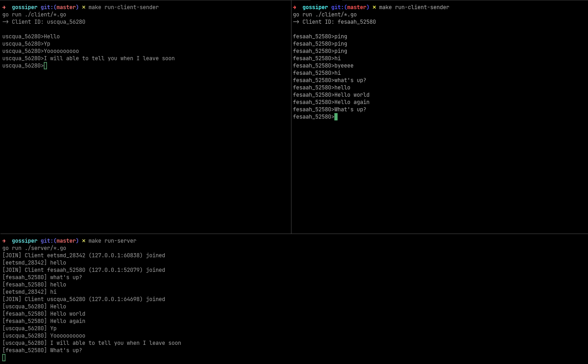

# Gossiper

I probably should have named this something else, but this is not a real project.

I am just playing with UDP and replicating TCP-like features (yep, it's stupid) to achieve a message broker-like system via UDP with nearly the reliability of TCP.

## MESSAGE FORMATS

Every message has 3 common parts; type|the client ID and the tail; total_bytes (used by the server to verify the data is in good shape)

> message: MSG|client_id|message_id|message|total_bytes
>
> ack: ACK|client_id|message_id|total_bytes
>
> ping: PING|client_id|total_bytes

Live clients: Since it's UDP, nothing is actually kept alive per se, but I want my server to know what clients are still "alive" before sending a message and for ACK counting before destroying a message.

## How?

Clients reach out to the server at an interval provided by the SERVER, and it is periodically checked to ensure that the client is still connected.
